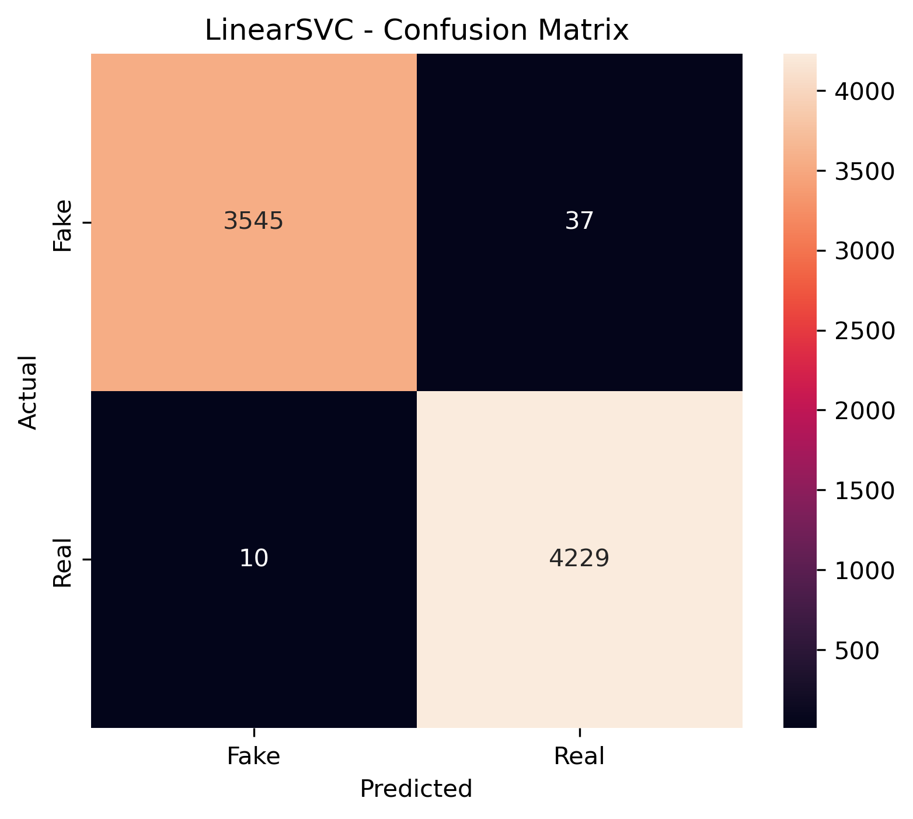
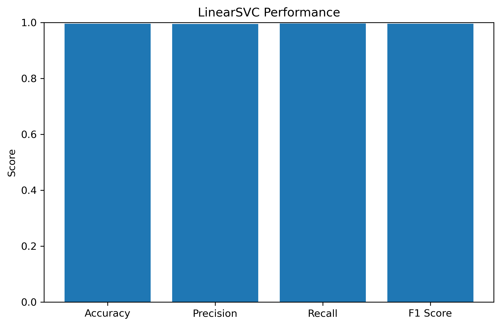
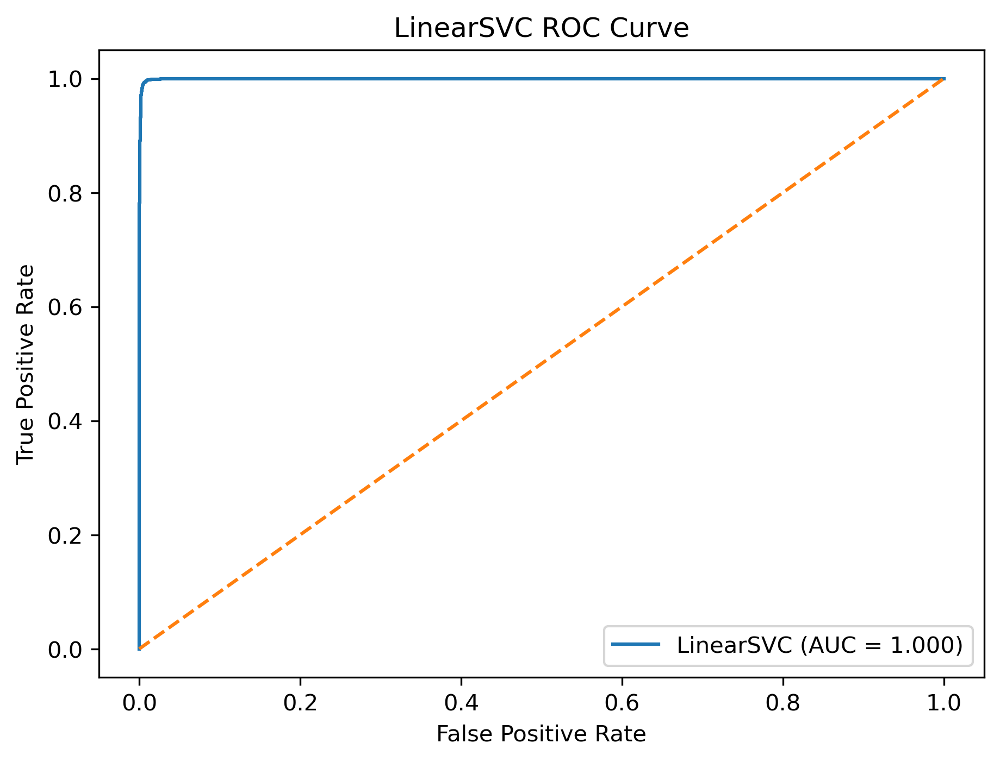

# 📰 Fake News Detection using NLP

An end-to-end Natural Language Processing and Machine Learning project that
classifies news articles as **Fake or Real** using TF-IDF feature extraction and
a Linear Support Vector Machine (LinearSVC).

The project includes data preprocessing, exploratory data analysis, duplicate
removal, NLP feature engineering, model comparison, evaluation, model
persistence, and an interactive Streamlit web application.

---

## 🎯 Project Objective

The objective of this project is to develop a machine learning system capable of
classifying news articles as:

- **Fake News**
- **Real News**

The project demonstrates a complete NLP machine learning workflow, from raw text
data to a deployable prediction application.

---

## 💡 Problem Statement

The rapid spread of misinformation makes it increasingly difficult to
distinguish reliable news from fabricated content.

This project explores how Natural Language Processing and Machine Learning can
be used to automatically classify news articles based on their textual content.

The system analyzes the **news title and article content** and predicts whether
the article is likely to be Fake or Real.

> ⚠️ This project is an educational machine-learning classifier and is not a
> replacement for professional fact-checking or journalistic verification.

---

# 🔄 Project Workflow

```text
Raw News Dataset
       ↓
Data Loading
       ↓
Data Cleaning
       ↓
Duplicate Removal
       ↓
Exploratory Data Analysis
       ↓
Title + Article Combination
       ↓
Train/Test Split
       ↓
TF-IDF Vectorization
       ↓
Model Training
       ↓
Model Comparison
       ↓
Model Evaluation
       ↓
Best Model Selection
       ↓
Model & Vectorizer Saving
       ↓
Streamlit Application
```

---

# 📂 Dataset

The project uses a dataset containing separate files for fake and real news
articles.

```text
Fake.csv → Fake News
True.csv → Real News
```

The datasets contain information such as:

- News title
- Article text
- Subject
- Date

The target variable was created during preprocessing:

```text
0 → Fake
1 → Real
```

---

# 🧹 Data Preprocessing

The following preprocessing steps were performed:

### 1. Dataset Combination

The Fake and Real datasets were combined into a single DataFrame.

### 2. Target Label Creation

A numerical target variable was created:

```text
Fake → 0
Real → 1
```

### 3. Duplicate Removal

Duplicate records were identified and removed.

Duplicate article content was also checked to prevent the same article from
appearing in both the training and testing datasets.

### 4. Data Shuffling

The combined dataset was randomly shuffled using a fixed random seed.

### 5. Text Combination

The news title and article content were combined into a single text feature.

```text
Title + Article Text
```

### 6. Train/Test Split

The dataset was divided into:

- **80% Training**
- **20% Testing**

Stratified splitting was used to maintain the class distribution.

### 7. Data Leakage Check

After removing duplicate article content, the training and testing datasets were
checked for exact text overlap.

```text
Exact text overlap = 0
```

This helps ensure that identical articles are not present in both datasets.

---

# 🔤 Natural Language Processing

## TF-IDF Vectorization

The project uses **Term Frequency-Inverse Document Frequency (TF-IDF)** to
convert news articles into numerical feature vectors.

The vectorizer was configured using:

```python
TfidfVectorizer(
    stop_words="english",
    ngram_range=(1, 2),
    max_features=50000
)
```

### Configuration

- English stop words removed
- Unigrams and bigrams used
- Maximum 50,000 features
- TF-IDF fitted only on the training data

The final dataset contained:

```text
Training samples: 31,282
Testing samples:   7,821
TF-IDF features:  50,000
```

---

# 🤖 Machine Learning Models

The following models were compared:

## 1. Logistic Regression

A linear classification algorithm commonly used for binary classification
problems.

## 2. Multinomial Naive Bayes

A probabilistic algorithm that works particularly well with text classification
and word-frequency-based features.

## 3. LinearSVC

A linear Support Vector Machine designed for high-dimensional classification
problems.

It is particularly suitable for sparse TF-IDF text representations.

---

# 📊 Model Comparison

The models were evaluated using:

- Accuracy
- Precision
- Recall
- F1 Score

### Results

| Model               |   Accuracy |  Precision |     Recall |   F1 Score |
| ------------------- | ---------: | ---------: | ---------: | ---------: |
| **LinearSVC**       | **99.40%** | **99.13%** | **99.76%** | **99.45%** |
| Logistic Regression |     98.56% |     98.07% |     99.29% |     98.68% |
| Naive Bayes         |     95.13% |     95.95% |     95.02% |     95.48% |

---

# 🏆 Final Model

## LinearSVC

Based on the clean train/test evaluation, **LinearSVC was selected as the final
model**.

### Final Performance

**Accuracy:** 99.40%

**Precision:** 99.13%

**Recall:** 99.76%

**F1 Score:** 99.45%

The model was selected because it achieved the highest F1 Score among the
evaluated models.

---

# 📈 Model Evaluation

## Confusion Matrix

The confusion matrix shows how the LinearSVC model performed on Fake and Real
news articles.



---

## Model Performance



---

## ROC Curve



The ROC curve evaluates the model's ability to distinguish between Fake and Real
news using the LinearSVC decision scores.

---

# 🌐 Streamlit Application

The project includes an interactive Streamlit web application.

Users can enter:

- News title
- News article content

The application processes the text using the saved TF-IDF vectorizer and sends
the resulting features to the trained LinearSVC model.

The application then displays:

```text
Prediction
    ↓
REAL NEWS
or
FAKE NEWS
```

It also displays the model's decision score.

> The LinearSVC decision score is not a calibrated probability, so the
> application does not incorrectly present it as a probability.

---

# ▶️ How to Run the Application

## 1. Clone the Repository

```bash
git clone https://github.com/Siddhesh-Dhumal/fake-news-detection-nlp.git
```

Move into the project directory:

```bash
cd fake-news-detection-nlp
```

---

## 2. Install Dependencies

```bash
pip install -r requirements.txt
```

---

## 3. Run Streamlit

```bash
streamlit run app.py
```

The application should open in your browser.

Usually:

```text
http://localhost:8501
```

---

# 📁 Project Structure

```text
fake-news-detection-nlp/
│
├── Data/
│   ├── Fake.csv
│   └── True.csv
│
├── models/
│   ├── fake_news_linear_svc.pkl
│   └── tfidf_vectorizer.pkl
│
├── notebooks/
│   └── fake_news_detection.ipynb
│
├── results/
│   ├── linear_svc_confusion_matrix.png
│   ├── linear_svc_performance.png
│   └── linear_svc_roc_curve.png
│
├── app.py
├── requirements.txt
├── .gitignore
└── README.md
```

---

# 💾 Saved Model Files

The trained machine learning model is saved using Joblib.

### LinearSVC Model

```text
models/fake_news_linear_svc.pkl
```

### TF-IDF Vectorizer

```text
models/tfidf_vectorizer.pkl
```

Both files are required by the Streamlit application.

The same fitted TF-IDF vectorizer used during training is loaded when making
predictions on new articles.

---

# 📓 Jupyter Notebook

The complete experimentation and analysis are available in:

```text
notebooks/fake_news_detection.ipynb
```

The notebook includes:

- Dataset loading
- Data exploration
- Data cleaning
- Duplicate detection
- EDA
- Text preparation
- Train/test splitting
- TF-IDF vectorization
- Model training
- Model comparison
- Model evaluation
- Model saving

---

# 🛠️ Technologies Used

### Programming

- Python

### Data Analysis

- Pandas
- NumPy

### Visualization

- Matplotlib
- Seaborn

### NLP

- TF-IDF

### Machine Learning

- Scikit-learn
- Logistic Regression
- Multinomial Naive Bayes
- LinearSVC

### Deployment

- Streamlit

### Model Persistence

- Joblib

### Development Tools

- Jupyter Notebook
- Visual Studio Code
- Git
- GitHub

---

# 📌 Important Methodological Note

An initial experiment produced unusually high performance using XGBoost.

However, a subsequent leakage check found **1,722 exact text overlaps between
the original training and testing datasets**.

That experiment was discarded.

The dataset was then cleaned by removing duplicate article content, and the
train/test split was recreated.

After cleaning:

```text
Exact text overlap = 0
```

The final reported results are therefore based on the **clean dataset and
leakage-free train/test split**, with LinearSVC achieving:

```text
Accuracy = 99.40%
F1 Score = 99.45%
```

This approach provides a more reliable evaluation of the model.

---

# ⚠️ Limitations

This project has several limitations:

- The dataset may contain historical or source-specific patterns.
- High test performance does not guarantee performance on future news.
- The model only analyzes textual information.
- The classifier cannot independently verify whether claims are factually
  correct.
- Decision scores from LinearSVC are not calibrated probabilities.
- Real-world misinformation can use writing styles that differ from the training
  dataset.

---

# 🚀 Future Improvements

Potential improvements include:

### NLP

- Text normalization
- Lemmatization
- Word embeddings
- Word2Vec
- GloVe
- Transformer-based models
- BERT

### Machine Learning

- Hyperparameter tuning
- Cross-validation
- Probability calibration
- Ensemble models

### Application

- URL-based article extraction
- Batch CSV prediction
- Prediction history
- Confidence visualization
- Explainable AI
- Source credibility analysis

### Deployment

- Streamlit Cloud
- Docker
- REST API
- Cloud deployment

---

# 🎓 Skills Demonstrated

This project demonstrates practical experience in:

- Python
- Data preprocessing
- Exploratory Data Analysis
- Natural Language Processing
- TF-IDF
- Text classification
- Machine Learning
- Model comparison
- Model evaluation
- Data leakage detection
- LinearSVC
- Scikit-learn
- Model persistence
- Streamlit
- Git
- GitHub

---

# 👨‍💻 Author

## Siddhesh Dhumal

**B.Tech — Robotics and Automation**

Interested in:

- Data Science
- Machine Learning
- Artificial Intelligence
- Robotics
- Computer Vision

---

# 🎓 Internship Project

This project was developed as part of a **Data Science Internship at Codec
Technologies** to gain practical experience in:

- Natural Language Processing
- Machine Learning
- Model evaluation
- Data preprocessing
- Application development
- GitHub project management

---

# 📌 Project Status

**Completed ✅**

### Completed Components

- ✅ Dataset preparation
- ✅ Data cleaning
- ✅ Duplicate removal
- ✅ Data leakage check
- ✅ Exploratory Data Analysis
- ✅ TF-IDF feature extraction
- ✅ Logistic Regression
- ✅ Multinomial Naive Bayes
- ✅ LinearSVC
- ✅ Model comparison
- ✅ Confusion matrix
- ✅ ROC curve
- ✅ Final model selection
- ✅ Model persistence
- ✅ Streamlit application
- ✅ GitHub repository

---

⭐ **If you found this project useful, consider giving the repository a star!**
